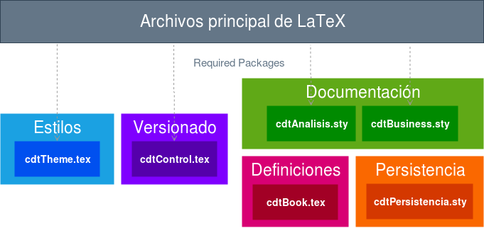

# Especificacion-SW

Plantilla del documento para la especificación de un proyecto de software

## Requerimientos, Instalación y Ejemplo

### Comandos a ejecutar

Instalar texlive, texworks y ack (ack es opcional).

    apt-get install texlive-full texworks ack
    git clone git@gitlab.com:DanielOrtegaZ/Especificacion-SW.git
    cd Especificacion-SW
    chmod 775 compile.sh
    ./compile.sh main.tex

## Contenido

### Packetes Contenidos

- **cdtAnalisis.sty** - Requerimientos y Casos de Uso
- **cdtBusiness.sty** - Reglas de negocio
- **cdtControl.sty** - Evaluación y Control de Versiones
- **cdtPersistencia.sty** - Referencias Cruzadas y completar
- **cdtBook.sty** - Conjunto de Comandos Base
- **cdtTheme.sty** - Estilos para el Documento

### Packetes no Contenidos

- cdtProcesos.sty
- cdtPruebas.sty

## Stack de Paquetes

La estructura de los paquetes es la siguiente

## Maintainers

- Ulises Vélez Saldaña
- Daniel Isaí Ortega [@DanielOrtegaZ](https://gitlab.com/DanielOrtegaZ) [Github](https://github.com/DanielOrtegaZ)

## TO-DO LIST

- [ ] Entradas y Salidas autocreadas
- [ ] Organizar Stack
- [ ] Documento Técnico
    - [ ] cdtTheme.sty
    - [ ] cdtBook.sty
    - [x] cdtPersistencia.sty
    - [ ] cdtControl.sty
    - [ ] cdtBusiness.sty
    - [ ] cdtAnalisis.sty

## Future Changes
- [ ] Manejo de variables (creacion y asignación) con \def,\edef,\gdef,\xdef
- [ ] Ver si \nameref\* optimiza \refElem y \refIdElem
- [ ] Utilizar \@author, \@title, \@organizacion y cambiar la definición de \maketitle
- [ ] Corregir hypertarget similar a como se realizó en docs.tex
- [ ] Fix Interfaces Cross Reference Error
