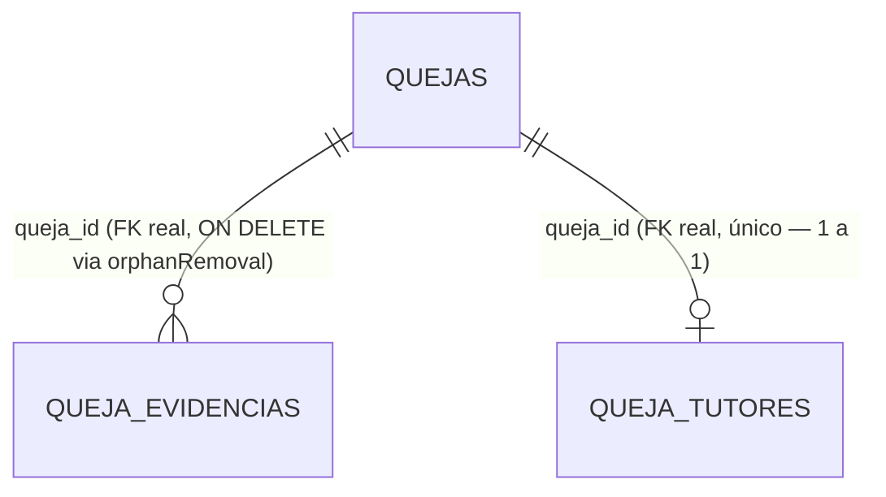

# Respaldo de estructura — base de datos `defensoria_db` (snapshot 2026-08-17)

Este documento es una **fotografía de la estructura** (tablas, columnas, relaciones) de
`defensoria_db` tal como está definida hoy en el código de los microservicios, guardada antes
de que otra persona empiece a modificarla. **No sustituye un respaldo real de la base de
datos** — es la referencia escrita de "cómo estaba" para poder comparar después. Los pasos
para el respaldo real (el que sí guarda los datos) están en la sección 0, y conviene hacerlo
primero.

---

## 0. Respaldo real — hazlo antes de que tu compañero empiece

Tienes dos formas, elige la que te sea más rápida ahora mismo:

### Opción A — Botón ya existente en el panel de administración (más fácil)

`Frontend-Admin` → **Seguridad y Respaldos** → **"Ejecutar respaldo manual"**. Internamente
corre `pg_dump -F p` (formato plano, `schema + datos` completos) contra `defensoria_db` y lo
deja listado ahí mismo para descargar. Es exactamente el mismo mecanismo que ya usa el
respaldo automático diario (4:00 AM). Con un clic tienes un `.sql` completo, descargable.

### Opción B — Por SSH, directo en la VPS backend (`2.25.78.22`)

Si además quieres un archivo **solo de estructura** (sin datos, mucho más chico y fácil de
leer/comparar en un diff), corre esto en la VPS backend:

```bash
# Solo estructura (schema-only) -- lo que pediste, para comparar "antes vs. después"
pg_dump -h localhost -p 5432 -U postgres --schema-only \
  -f defensoria_db_estructura_$(date +%Y%m%d).sql defensoria_db

# Completo (estructura + datos), como respaldo de seguridad real
pg_dump -h localhost -p 5432 -U postgres -F p \
  -f defensoria_db_completo_$(date +%Y%m%d).sql defensoria_db
```

Te pedirá la contraseña de Postgres (la misma de `config-files/*/config/*.yml`). Baja el
archivo a tu computadora con `scp` para tenerlo fuera del servidor:

```bash
scp root@2.25.78.22:~/defensoria_db_estructura_$(date +%Y%m%d).sql .
```

---

## 1. Cómo se conectan las tablas — relaciones REALES (llave foránea en Postgres)

**Importante, y es el hallazgo más relevante de este documento**: de las 11 tablas que existen
hoy, **solo 2 relaciones tienen una llave foránea real** a nivel de base de datos. Todas las
demás "conexiones" entre tablas son lógicas (dos columnas con el mismo valor, ej. un folio o
un correo), no algo que Postgres esté obligando — porque cada tabla la administra un
microservicio distinto, con su propia clase de entidad, y JPA solo genera FK reales entre
tablas que pertenecen al mismo microservicio.



Ambas las crea y mantiene `queja-service` (son las únicas dos tablas donde declaró una
relación `@ManyToOne`/`@OneToOne` de JPA hacia `Queja` dentro de su propio código).

## 2. Cómo se conectan las tablas — relaciones LÓGICAS (mismo valor, sin FK)

Estas son las que en la práctica sostienen todo el flujo entre microservicios. Ninguna está
declarada como llave foránea en Postgres — si alguien borra o cambia el valor de un lado, la
base de datos **no lo impide ni avisa**. Es el punto más frágil del diseño actual y el que más
conviene tener presente si tu compañero va a tocar cualquiera de estas tablas.

| Tabla / columna origen | Se relaciona por valor con | Tabla / columna destino | Quién la usa |
|---|---|---|---|
| `usuarios.correo_institucional` | = | `quejas.correo_institucional` | `auth-service` ↔ `queja-service` (identifica de quién es cada queja) |
| `quejas.numero_folio` | = | `acuerdos_conciliacion.numero_folio` | `queja-service` ↔ `revision-service` (a qué queja pertenece el acuerdo) |
| `quejas.correo_institucional` | = | `acuerdos_conciliacion.correo_institucional` | igual — doble llave folio+correo |
| `usuarios.correo_institucional` / `quejas.correo_institucional` | = | `notificaciones.correo_destino` | `notificaciones-service` (a quién le pertenece cada aviso) |
| `quejas.unidad_academica_clave` | = | `dependencias.clave` | `catalogo-service` (a qué dependencia corresponde) |
| `quejas.area_turnada` | = | `dependencias.clave` | igual, cuando ya fue turnada |
| `dependencias.clave_padre` | = | `dependencias.clave` | jerarquía del propio catálogo (auto-referencia) |
| `quejas.defensor_asignado` | = | `personal_administrativo.correo_institucional` | `revision-service` (quién quedó a cargo) |
| `bitacora_acciones.usuario` | = | `personal_administrativo.correo_institucional` | `admin-service` (quién hizo la acción) |
| `plantillas_documentos.actualizado_por` | = | `personal_administrativo.correo_institucional` | `admin-service` |

Además, dos tablas físicas son escritas por **dos microservicios distintos**, cada uno con su
propia clase de entidad Java sobre la misma tabla (ninguno sabe del otro a nivel de código):

- **`quejas`**: la escribe `queja-service` (columnas de registro/identidad del quejoso) **y**
  `revision-service` (columnas de flujo: `estatus`, `motivo_rechazo`, `area_turnada`,
  `defensor_asignado`, etc.).
- **`acuerdos_conciliacion`**: la crea `revision-service`, y `queja-service` la lee/actualiza
  (respuesta del quejoso: `estado`, `fecha_respuesta`, `comentario_quejoso`).

## 3. ⚠️ Hallazgo — la columna `quejas.estatus` tiene dos documentaciones distintas en el código

Vale la pena que tu compañero lo sepa antes de tocar nada: el comentario en la clase `Queja`
de **`queja-service`** dice que los valores posibles son `"RECIBIDA" | "EN_REVISION" |
"FINALIZADA"`. Pero **`revision-service`**, que es quien de verdad escribe esta columna al
rechazar/turnar una queja, usa `"RECIBIDA" | "EN_VALIDACION" | "RECHAZADA" | "TURNADA"` — y el
resto del sistema (frontend del panel, filtros de "Mis Quejas") ya está construido esperando
estos últimos valores. El comentario de `queja-service` quedó desactualizado de una versión
anterior y nunca se corrigió — no representa la realidad actual de la columna. Si alguien lee
solo ese comentario y programa contra `"EN_REVISION"`/`"FINALIZADA"`, va a comparar contra
valores que nunca ocurren.

## 4. Las 11 tablas — estructura completa

### 4.1 `usuarios` (dueño: `auth-service`)

| Columna | Tipo | Restricciones |
|---|---|---|
| id | bigint | PK, autoincrement |
| nombre | varchar | NOT NULL |
| correo_institucional | varchar | NOT NULL, **UNIQUE** |
| boleta | varchar | NOT NULL, **UNIQUE** |
| password | varchar | NULL mientras la cuenta no se activa (BCrypt) |
| unidad_academica | varchar | |
| activo | boolean | default false |
| correo_personal | varchar | |
| telefono_celular | varchar | |
| domicilio | text | |
| nombre_tutor | varchar | |
| parentesco_tutor | varchar | |
| telefono_tutor | varchar | |
| codigo_recuperacion | varchar | hash BCrypt del código de 6 dígitos |
| fecha_expiracion_codigo | timestamp | |

### 4.2 `quejas` (dueño compartido: `queja-service` + `revision-service`)

| Columna | Tipo | Restricciones | Quién la escribe |
|---|---|---|---|
| id | bigint | PK, autoincrement | — |
| numero_folio | varchar | NOT NULL, **UNIQUE** | queja-service |
| correo_institucional | varchar | NOT NULL | queja-service |
| motivo | varchar | NOT NULL | queja-service |
| descripcion | text | | queja-service |
| ruta_evidencia | varchar | **@Deprecated**, ya no se escribe | queja-service (legado) |
| fecha_creacion | timestamp | | queja-service |
| nombre_quejoso | varchar | | queja-service |
| apellido_paterno_quejoso | varchar | | queja-service |
| apellido_materno_quejoso | varchar | | queja-service |
| fecha_nacimiento_quejoso | date | | queja-service |
| tipo_identificacion_quejoso | varchar | `"alumno"` \| `"empleado"` | queja-service |
| numero_identificacion_quejoso | varchar | máx. 12 caracteres, solo dígitos (regla de negocio) | queja-service |
| unidad_academica_clave | varchar | referencia lógica a `dependencias.clave` | queja-service |
| fecha_hechos | date | | queja-service |
| nombre_denunciado | varchar | | queja-service |
| apellido_denunciado | varchar | | queja-service |
| origen_registro | varchar | `"AUTENTICADO"` \| `"PUBLICO"` \| `"MANUAL"` | queja-service / revision-service |
| **estatus** | varchar | default `"RECIBIDA"` — ver §3, valores reales: RECIBIDA/EN_VALIDACION/RECHAZADA/TURNADA | revision-service |
| motivo_rechazo | text | | revision-service |
| area_turnada | varchar | referencia lógica a `dependencias.clave` | revision-service |
| defensor_asignado | varchar | referencia lógica a `personal_administrativo.correo_institucional` | revision-service |
| comentarios_recepcion | text | | revision-service |
| validado_por | varchar | correo de quien procesó (rechazó/turnó) | revision-service |
| fecha_validacion | timestamp | | revision-service |
| fecha_turnado | timestamp | | queja-service y revision-service (mapeada en ambos) |
| numero_oficio | varchar | solo Registro Manual | revision-service |
| fecha_recepcion_fisica | date | solo Registro Manual | revision-service |
| tipo_documento_fisico | varchar | `"IDENTIFICACION"` \| `"OFICIO"` \| `"ESCRITO_LIBRE"` \| `"OTRO"` | revision-service |
| ubicacion_fisica_expediente | varchar | solo Registro Manual | revision-service |
| tipo_usuario_manual | varchar | `"alumno"` \| `"empleado"` \| `"externo"`, solo Registro Manual | revision-service |

### 4.3 `queja_tutores` (dueño: `queja-service`)

| Columna | Tipo | Restricciones |
|---|---|---|
| id | bigint | PK, autoincrement |
| queja_id | bigint | **FK real** → `quejas.id`, NOT NULL, **UNIQUE** (1 a 1) |
| nombre | varchar | |
| apellido_paterno | varchar | |
| apellido_materno | varchar | |
| parentesco | varchar | |
| correo | varchar | |
| telefono | varchar | |

### 4.4 `queja_evidencias` (dueño: `queja-service`; solo lectura desde `revision-service`)

| Columna | Tipo | Restricciones |
|---|---|---|
| id | bigint | PK, autoincrement |
| queja_id | bigint | **FK real** → `quejas.id`, NOT NULL |
| nombre_archivo | varchar | NOT NULL |
| tipo_mime | varchar | |
| tamanio_bytes | bigint | |
| contenido | **bytea** | NOT NULL — archivo completo, sin `@Lob` a propósito (ver comentario en la entidad) |
| fecha_subida | timestamp | |

### 4.5 `acuerdos_conciliacion` (dueño compartido: `revision-service` crea, `queja-service` responde)

| Columna | Tipo | Restricciones |
|---|---|---|
| id | bigint | PK, autoincrement |
| numero_folio | varchar | NOT NULL, referencia lógica a `quejas.numero_folio` |
| correo_institucional | varchar | NOT NULL, referencia lógica a `usuarios.correo_institucional` |
| asunto | varchar | NOT NULL |
| terminos | text | NOT NULL |
| estado | varchar | default `"PENDIENTE"` → `"ACEPTADO"` \| `"RECHAZADO"` |
| fecha_emision | timestamp | |
| fecha_respuesta | timestamp | |
| comentario_quejoso | text | |
| creado_por | varchar | correo del staff que lo emitió |

### 4.6 `notificaciones` (dueño: `notificaciones-service`)

| Columna | Tipo | Restricciones |
|---|---|---|
| id | bigint | PK, autoincrement |
| correo_destino | varchar | NOT NULL, referencia lógica a `usuarios.correo_institucional` |
| tipo | varchar | NOT NULL — `LOGIN` \| `QUEJA_CREADA` \| `CAMBIO_ESTATUS` \| `CONCILIACION` \| `GENERAL` |
| titulo | varchar | NOT NULL |
| mensaje | text | |
| leida | boolean | default false |
| fecha_creacion | timestamp | |
| enlace | varchar | ruta relativa opcional dentro del panel |

### 4.7 `dependencias` (dueño: `catalogo-service`)

| Columna | Tipo | Restricciones |
|---|---|---|
| id | bigint | PK, autoincrement |
| clave | varchar(20) | NOT NULL, **UNIQUE** |
| clave_padre | varchar(20) | auto-referencia lógica a `clave` |
| nombre | varchar | NOT NULL |
| abreviatura | varchar(30) | |
| tipo | varchar(60) | NOT NULL |
| categoria | varchar(150) | |
| nivel | integer | NOT NULL, default 1 |
| pagina_manual | integer | |
| activo | boolean | NOT NULL, default true |
| notas | text | |
| correo_contacto | varchar(150) | |
| nombre_titular | varchar(150) | |
| creado_en | timestamp | |

### 4.8 `personal_administrativo` (dueño: `admin-service`; espejo de solo lectura en `revision-service`)

| Columna | Tipo | Restricciones |
|---|---|---|
| id | bigint | PK, autoincrement |
| nombre_completo | varchar | NOT NULL |
| numero_empleado | varchar | NOT NULL, **UNIQUE** |
| correo_institucional | varchar | NOT NULL, **UNIQUE** |
| rol | varchar(40) | NOT NULL — `ADMIN_SISTEMAS` \| `RECEPCIONISTA` \| `ANALISTA_PRIMER_CONTACTO` \| `SUBDEFENSOR` \| `DEFENSOR` |
| password | varchar | NOT NULL (BCrypt) |
| cuenta_temporal | boolean | NOT NULL, default true |
| forzar_cambio_password | boolean | NOT NULL, default true |
| activo | boolean | NOT NULL, default true |
| fecha_creacion | timestamp | NOT NULL |
| ultimo_login | timestamp | |

### 4.9 `plantillas_documentos` (dueño: `admin-service`)

| Columna | Tipo | Restricciones |
|---|---|---|
| id | bigint | PK, autoincrement |
| tipo | varchar(80) | NOT NULL, **UNIQUE** — clave de negocio, ej. `OFICIO_SOLICITUD_INFORMACION` |
| nombre | varchar | NOT NULL |
| contenido | text | NOT NULL |
| activa | boolean | NOT NULL, default true |
| actualizado_en | timestamp | |
| actualizado_por | varchar | referencia lógica a `personal_administrativo.correo_institucional` |

### 4.10 `bitacora_acciones` (dueño: `admin-service`)

| Columna | Tipo | Restricciones |
|---|---|---|
| id | bigint | PK, autoincrement |
| usuario | varchar | NOT NULL, referencia lógica a `personal_administrativo.correo_institucional` |
| accion_realizada | varchar | NOT NULL |
| ip | varchar | NOT NULL |
| fecha | timestamp | NOT NULL |

### 4.11 `preguntas_chatbot` (dueño: `chatbot-service`)

| Columna | Tipo | Restricciones |
|---|---|---|
| id | bigint | PK, autoincrement |
| categoria | varchar(80) | NOT NULL |
| pregunta | varchar(300) | NOT NULL |
| respuesta | text | NOT NULL |
| orden | integer | NOT NULL, default 0 — orden global, no por categoría |
| activo | boolean | NOT NULL, default true |
| creado_en | timestamp | NOT NULL |
| actualizado_en | timestamp | NOT NULL |

---

## 5. Nota sobre `primer-contacto-service` / `subdefensoria-service`

Estos dos microservicios (en desarrollo, ver `docs/REQUERIMIENTOS.md` §5) **no usan
`defensoria_db`** — cada uno corre con su propia base H2 en memoria, que se borra en cada
reinicio del contenedor. No forman parte de este respaldo porque no hay nada persistente que
respaldar todavía; no se tocaron como parte de esta tarea.

---

## 6. Cómo se generó este documento

Leyendo directamente las clases `@Entity` de cada microservicio en el código fuente (no
conectándose a la base de datos en vivo) — refleja lo que el código *dice* que debería existir.
Si quieres confirmar que la base de datos real coincide exactamente (por si alguna columna se
agregó/quitó a mano alguna vez), compara esto contra el resultado de
`pg_dump --schema-only` de la sección 0.
